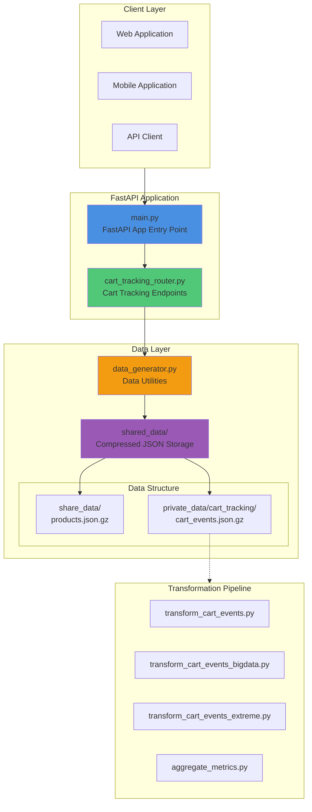

# TechStore Vietnam - Cart Tracking API

API Simulator cho việc tracking cart events (add to cart, remove from cart, view items, purchases, etc.) trong hệ thống e-commerce TechStore Vietnam.

## Architecture Diagram



## System Components

### 1. Application Entry Point
**File**: `main.py`
- Khởi tạo FastAPI application
- Configure CORS middleware
- Load routers
- Initialize shared data on startup

### 2. Cart Tracking Router
**File**: `routers/cart_tracking_router.py`
- Xử lý các cart tracking events
- Generate cart events data
- Query và filter events
- Calculate statistics và abandoned carts

**Event Types**:
- `add_to_cart` - Thêm sản phẩm vào giỏ
- `remove_from_cart` - Xóa sản phẩm khỏi giỏ
- `update_quantity` - Cập nhật số lượng
- `view_item` - Xem chi tiết sản phẩm
- `purchase` - Mua hàng thành công
- `scroll`, `exit_page`, `search` - User behavior events
- `add_to_wish_list` - Thêm vào wishlist
- `begin_checkout` - Bắt đầu checkout
- `add_shipping_info`, `add_payment_info` - Thông tin shipping/payment
- `payment_failed`, `order_cancelled` - Failed transactions

### 3. Data Generator (Refactored)
**File**: `shared/data_generator.py`

**Functions**:
- `initialize_shared_data()` - Load products data on startup
- `ensure_products_loaded()` - Thread-safe product loading
- `get_random_product()` - Get random product for event generation
- `get_random_customer()` - Get random customer ID
- `get_private_data_path()` - Path resolver for private data
- `get_share_data_path()` - Path resolver for shared data
- `load_compressed()` - Load compressed JSON files

**Data Storage**:
```
shared_data/
├── share_data/              # Shared across all routers
│   └── products.json.gz     # Product catalog
└── private_data/            # Router-specific data
    └── cart_tracking/
        └── cart_events.json.gz  # Cart tracking events
```

## Data Flow

```
1. Startup Flow:
   main.py → initialize_shared_data() → Load products.json.gz → SHARED_PRODUCTS (in-memory)

2. Event Generation Flow:
   POST /cart/generate/events → generate_cart_events_batch()
   → get_random_product() → get_random_customer()
   → save_compressed() → cart_events.json.gz

3. Event Query Flow:
   GET /cart/events → load_compressed(cart_events.json.gz)
   → filter & paginate → return results

4. Statistics Flow:
   GET /cart/statistics → load_compressed(cart_events.json.gz)
   → aggregate by event_type, source, device
   → calculate metrics → return statistics
```

## API Endpoints

### Cart Tracking Endpoints

| Endpoint | Method | Description |
|----------|--------|-------------|
| `/cart/` | GET | API information |
| `/cart/events` | GET | List cart events với filters |
| `/cart/events/customer/{id}` | GET | Events của customer cụ thể |
| `/cart/events/product/{id}` | GET | Events của product cụ thể |
| `/cart/events/session/{id}` | GET | Events của session cụ thể |
| `/cart/statistics` | GET | Cart statistics và metrics |
| `/cart/abandoned` | GET | Abandoned cart sessions |
| `/cart/generate/events` | POST/GET | Generate cart events data |
| `/cart/generate/status` | GET | Generation progress status |

### Query Parameters

**GET /cart/events**:
- `limit` (1-1000): Number of results
- `offset` (0+): Pagination offset
- `event_type`: Filter by event type
- `source`: Filter by source (website, mobile_app, mobile_web)
- `device`: Filter by device (desktop, mobile, tablet)
- `start_date`: ISO format start date
- `end_date`: ISO format end date

**GET /cart/abandoned**:
- `limit` (1-200): Number of results
- `hours_threshold` (1-168): Hours since last activity

**POST /cart/generate/events**:
- `count` (100-1,000,000): Number of events to generate
- `method=new`: Append to existing data (default: replace)

## Data Generation

### Generating Cart Events

```bash
# Generate 10,000 events (replace existing)
curl -X POST "http://localhost:8000/cart/generate/events?count=10000"

# Append 5,000 more events
curl -X POST "http://localhost:8000/cart/generate/events?count=5000&method=new"

# Check generation progress
curl "http://localhost:8000/cart/generate/status"
```

### Event Structure

```json
{
  "event_id": "evt_abc123",
  "event_type": "add_to_cart",
  "timestamp": "2025-12-18T10:30:00",
  "timestamp_unix": 1734519000000,
  "session_id": "sess_xyz789",
  "customer_id": 123456,
  "is_guest": false,
  "source": "website",
  "device": "desktop",
  "browser": "Chrome",
  "product_id": 42,
  "product_name": "Laptop ASUS Gaming i7 16GB RAM",
  "product_price_vnd": 25000000,
  "quantity": 1,
  "line_total_vnd": 25000000
}
```

## Project Structure

```
Test/
├── main.py                          # FastAPI application entry point
├── requirements.txt                 # Python dependencies
├── routers/                         # API routers
│   ├── __init__.py
│   └── cart_tracking_router.py      # Cart tracking endpoints
├── shared/                          # Shared utilities
│   └── data_generator.py            # Data generation utilities (refactored)
├── shared_data/                     # Data storage
│   ├── share_data/                  # Shared data across routers
│   │   └── products.json.gz         # Product catalog
│   └── private_data/                # Router-specific data
│       └── cart_tracking/
│           └── cart_events.json.gz  # Cart events data
└── transformation/                  # Data transformation pipeline
    ├── transform_cart_events.py
    ├── transform_cart_events_bigdata.py
    ├── transform_cart_events_extreme.py
    └── aggregate_metrics.py
```

## Installation & Usage

### Prerequisites
```bash
Python 3.8+
pip install -r requirements.txt
```

### Running the Application
```bash
# Development
python main.py

# Production with Uvicorn
uvicorn main:app --host 0.0.0.0 --port 8000 --reload
```

### Accessing the API
- **API Root**: http://localhost:8000
- **Interactive Docs**: http://localhost:8000/docs
- **ReDoc**: http://localhost:8000/redoc
- **Health Check**: http://localhost:8000/health

## Key Features

### 1. Async Data Loading
- Thread-safe product loading với asyncio.Lock
- Lazy loading: chỉ load khi cần
- In-memory caching để tăng performance

### 2. Compressed Storage
- Sử dụng gzip compression cho JSON files
- Giảm storage footprint đáng kể
- Fast decompression with gzip library

### 3. Batch Processing
- Generate events theo batches (50,000 events/batch)
- Progress tracking với ETA estimation
- Background task generation không block API

### 4. Realistic Data
- Vietnamese customer names và addresses
- Technology product catalog
- User sessions với guest users (~30%)
- Multiple event types covering full user journey

### 5. Advanced Analytics
- Event statistics by type, source, device
- Top products analysis
- Abandoned cart detection
- Add/remove ratio calculations

## Performance Considerations

- **Event Generation**: ~10,000 events/second
- **Storage**: ~1KB per event (compressed)
- **Memory**: Products loaded in-memory for fast access
- **Concurrency**: Thread-safe operations với asyncio.Lock

## License

MIT License - See LICENSE file for details

## Contact

- **Author**: minhngocnguyen
- **Email**: minh2210.nina@gmail.com
- **LinkedIn**: [minnguyen2210](https://www.linkedin.com/in/minnguyen2210/)

---

**Last Updated**: December 2025
